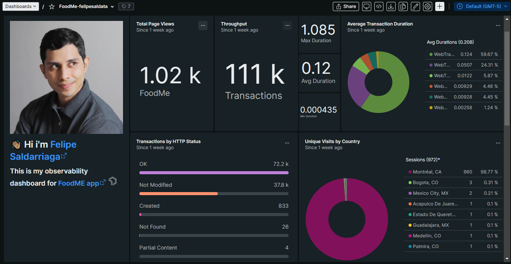
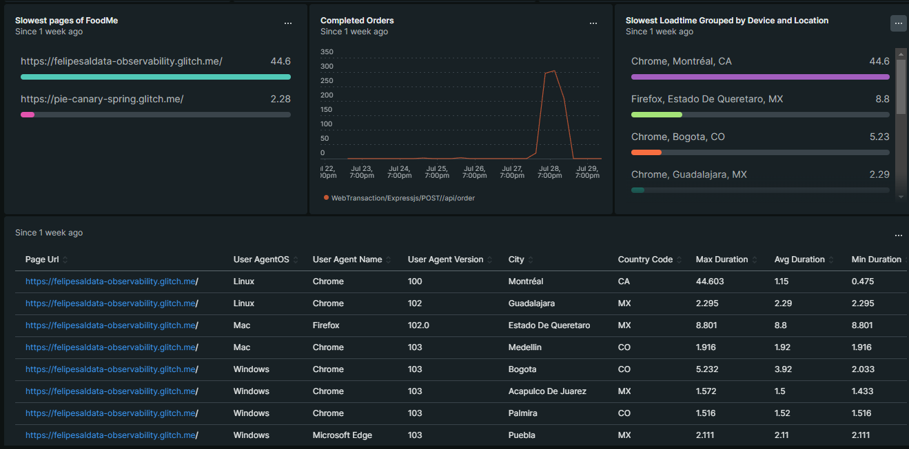
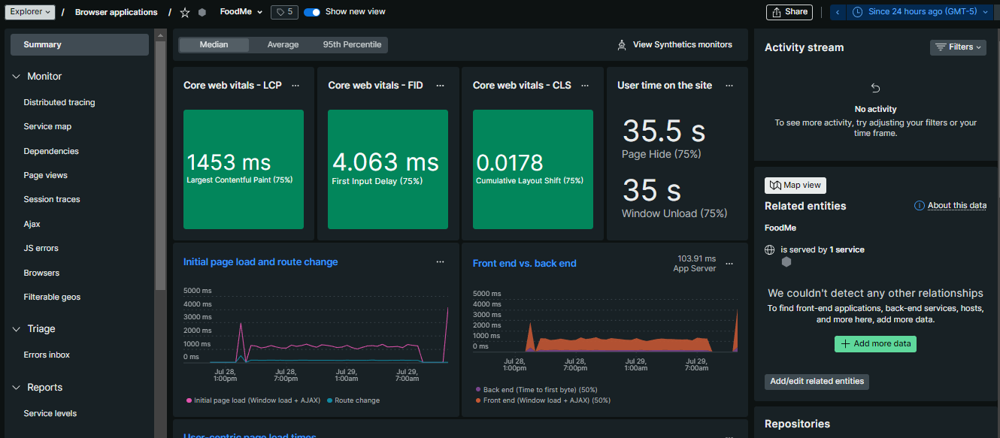
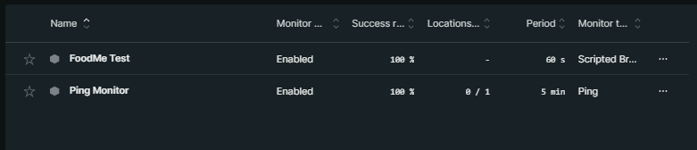

# 👨🏻‍🏫 App's Observability Dashboard

## **New Relic Final Dashboard**
>[**Watch the live version here (New Relic account required**)](https://onenr.io/0BQ1AqAAWQx)

## **Dashboard Preview**

## **Application Performance Monitoring APM**
Knowing how our dependencies across the  distributed system are working help us to detect anomalies, reduce latency, squash errors, and optimize customer’s experience.

## **🩺 App's Core Web Vitals ✅**
 These are the new metrics with which Google is going to measure the user experience. 

### **FoodMe App results:**
Everything's green and stable for our user during our first week of use.
 

## **🤖 Synthetics and Alerts 🚨**
### **🤖Synthetics**
Synthetic monitoring is a suite of automated, scriptable tools to monitor your websites, critical business transactions, and API endpoints. 

We use them to  simulate user traffic to proactively detect and resolve outages and poor performance of critical endpoints before our real customers.

### **🚨Alerts**
Let us set up robust and customizable alert policies for anything we need to get notified.

## **Special Thanks**
To all my friends and the community for interacting with the app, here is a piece of everyone at every chart🥰.